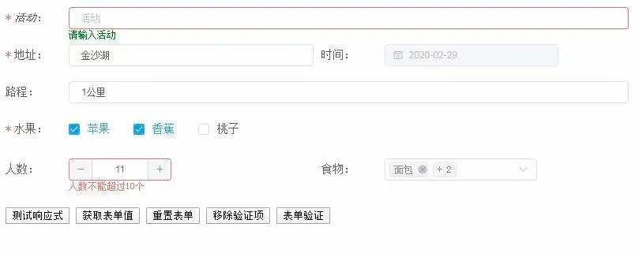

## Form 表单

#### 说明
Form（Form 表单）扩展至饿了么 ‘Form 表单’。
[Form 官方文档](https://element.eleme.cn/#/zh-CN/component/form)


#### 用法

```
import FastForm from '../common/form/index.js'
components: {
  FastForm
}
```

示例显示效果图：



#### 使用表单组件（模板写法）

（静态数据）

```
<template>
  <div>
    <fast-form
      :detail="createDetail()"
      :model="form"
      :columns="columns"
      :colon="colon"
      :rules="rules"
      ref="ruleForm"
      label-width="80px"
      label-position="left"
      @validate="validateEvent"
      size="mini"
    />
    <p />
    <button @click="doTestResponsiveMode">
      测试响应式
    </button>
    &nbsp;&nbsp;
    <button @click="getFormValues">
      获取表单值
    </button>
    &nbsp;&nbsp;
    <button @click="resetFields">
      重置表单
    </button>
    &nbsp;&nbsp;
    <button @click="clearValidate">
      移除验证项
    </button>
    &nbsp;&nbsp;
    <button @click="validateHandelr">
      表单验证
    </button>
  </div>
</template>

<script>
import FastComboBox from '../common/form/tools/combo-box.js'

export default {
  components: {
    FastComboBox
  },
  data () {
    // Form表单参数，定义一行显示2列
    this.columns = 2
    // 子控件配置
    this.colon = true
    this.checkbox = {
      options: [
        { label: '苹果', value: '01' },
        { label: '香蕉', value: '02' },
        { label: '桃子', value: '03' }
      ]
    }
    this.comboBox = {
      options: [
        { label: '面包', value: '01' },
        { label: '大饼', value: '02' },
        { label: '米饭', value: '03' },
        { label: '面条', value: '04' },
        { label: '饺子', value: '05' }
      ]
    }
    // comboBox 多选
    this.multiple = true
    /**
     * 自定义验证规则
     * 自定义校验 callback 必须被调用。
     */
    this.validateNum = (rule, value, callback) => {
      if (value > 10) {
        return callback(new Error('人数不能超过10个'));
      }
      callback();
    }
    return {
      // 响应式表单值数组对象
      form: {
        name: '',
        address: '金沙湖',
        time: '2020-02-29',
        distance: '1公里',
        fruit: ['02', '01'],
        num: 6,
        goods: ['01', '03', '05'],
        isGo: false
      },
      // 表单验证规则（也可以在单独的表单项中定义 rules）
      rules: {
        address: [{ required: true, message: '请输入地点', trigger: 'blur' }],
        num: [
          { validator: this.validateNum, trigger: 'change' }
        ]
      }
    }
  },
  methods: {
    createDetail () {
        return [
            {
              span: 2,
              name: 'name', // 注意这里的值 'name' 必须和 form 中的 name键对应，否则响应式将无效
              label: '活动',
              labelHtml: '<em>活动</em>',
              type: 'TextInput',
              placeholder: '活动',
              clearable: true,
              inlineMessage: false,
              rules: [{ required: true, message: '请输入活动', trigger: 'blur' }],
              slotNode: {
                /**
                 * @desc 自定义表单校验信息的显示方式
                 * @param {Object} h - el-form-item 控件的 render 渲染函数对象
                 * @param {String} error - 错误提示 比如：`请输入活动`
                 * @returns {Object} - render 函数创建的虚拟节点
                 */
                error: function (h, error) {
                  return h('div', { class: 'el-form-item__error', domProps: { innerHTML: `<span style="color: green;">${error}</span>` } })
                }
              }
            },
            {
              span: 1,
              name: 'address',
              label: '地址',
              type: 'TextInput',
              placeholder: '地址',
              disabled: false
            },
            {
              span: 1,
              name: 'time',
              label: '时间',
              type: 'DatePicker',
              placeholder: '时间',
              disabled: true,
              listeners: {
                change (val) {
                    // 定义事件
                    console.info(val)
                }
              }
            },
            {
              span: 2,
              name: 'distance',
              label: '路程',
              type: 'TextInput',
              placeholder: '路程'
            },
            {
              span: 2,
              name: 'fruit',
              options: this.checkbox.options,
              type: 'Checkbox',
              label: '水果',
              rules: [{ type: 'array', required: true, message: '请至少选择一个水果', trigger: 'change' }]
            },
            {
              span: 1,
              name: 'num',
              type: 'InputNumber',
              label: '人数',
              min: 0,
              disabled: false
            },
            {
              span: 1,
              name: 'goods',
              options: this.comboBox.options,
              multiple: this.multiple,
              collapseTags: true,
              displayField: 'label',
              valueField: 'value',
              type: 'ComboBox',
              label: '食物'
            },
            {
              span: 1,
              name: 'isGo',
              type: 'Switch',
              label: '出发',
              listeners: {
                change (value) {
                  // 定义事件
                  console.info(value);
                }
              }
            }
        ]
    },
    doTestResponsiveMode () {
      // 响应式测试
      this.form.name = '公园野餐'
      this.form.time = '2020-03-07'
      this.form.num = 8
      this.form.fruit = ['03', '02']
    },
    getFormValues () {
      // 获取表单的值
      console.info(this.form)
    },
    resetFields () {
      // 重置表单
      this.$refs['ruleForm'].resetFields()
    },
    clearValidate () {
      // 清空某个验证
      this.$refs['ruleForm'].clearValidate(['address'])
    },
    validateHandelr () {
      // 验证表单
      this.$refs['ruleForm'].validate(function () {
        console.info('验证通过');
      }, function () {
        console.info('未通过');
      })
    },
    validateEvent (prop, result, message) {
      // 任一表单项被校验后触发
      console.info(prop, result, message);
    }
  }
}
</script>

<style></style>

```

#### Form表单-单项数据流（props）

注意：这里只展示了自定义扩展后的 `prop` 属性，更多原有属性请查看 -> [Form 官方文档](https://element.eleme.cn/#/zh-CN/component/form#form-attributes)

名称 | 必填 | 类型 | 默认值 | 说明
---|---|---|---|---
labelWidth | — | String | 60px | 表单域标签的宽度
colon | — | String | false | 是否需要在 label 文字后面自动添加冒号`：`
columns | — | Number | 2 | 表单一行分多少列
detail | — | Array | [] | 表单详情数据
isRender | — | Boolean |  true | 是否渲染组件（v-if）
isDisplay | — | Boolean |  true | 是否显示组件（v-show）

#### Form-item-单项数据流（props）
注意：这里只展示了自定义扩展后的 `prop` 属性，更多原有属性请查看 -> [Form-Item Attributes 官方文档](https://element.eleme.cn/#/zh-CN/component/form#form-item-attributes)

名称 | 必填 | 类型 | 默认值 | 说明
---|---|---|---|---
span | — | Number | 0 | 占用多少列
name | — | String |  | 表单项名称（必须和Form表单model配置的数据名称一致）
type | — | String |  | 表单项控件类型
slotNode | — | Object |  | 自定义表单校验信息的显示方式 （使用请看示例代码）
labelHtml | — | String |  | 支持HTML显示的label名称

type 的可选值有：`Color`、`ComboBox`、`DatePicker`、`DateTimePicker`、`InputNumber`、`Label`、`Radio`、`Switch`、`TextArea`、`TextHidden`、`TextInput`、`TextPassword`、`Checkbox`、`Button`


#### listeners

[Form Events](https://element.eleme.cn/#/zh-CN/component/form#form-events)

#### 对外方法（Methods）
无


#### 注意：

- Form表单`Model`表单数据对象 参数中键的名称必须和子控件对象中的`name`比配。

```
<template>
  <div>
    <fast-form
      :detail="createDetail()"
      :model="form"
      :columns="columns"
    />
  </div>
</template>
<script>
export default {
    data(){
        return {
            this.columns = 2;
            form: {
                name1: ''
            },
            rules: {
                name1: [{ required: true, message: '请输入名称', trigger: 'blur' }]
              }
        }
    },
    methods: {
        createDetail () {
            return [
                {
                  span: 2,
                  name: 'name1', // 这里的 name1 必须和form对象中的 name1 对应，也必须和 rules 中的 name1 对应
                  label: '活动',
                  labelHtml: '<em>活动</em>',
                  type: 'TextInput',
                  placeholder: '活动'
                }
            ]
        }
    }
}
</script>
```

